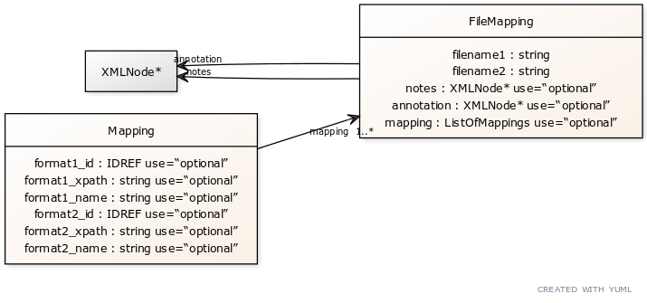

# combine_archive_mapping_harmony_2024
Notes from the HARMONY 2024 Breakout Session on Mapping SBGN and SBML Files

# Folders 
* asthma: Minerva export of DiseaseMaps diagram to SBML and SBGN from https://asthma.uni.lu/minerva; not discussed as it makes use of SBML multi complicating initial discussion
* deviser_spec_uml: a proposal specification schema for XML to support mapping in a COMBINE archive. Made using Deviser (https://github.com/sbmlteam/deviser)
* example_omex: OMEX specification and example from: https://figshare.com/articles/dataset/COMBINE_Archive_Show_Case/3427271 (.omex is a .zip file)
* glycolysis: Representations of the glycolysis pathway from BioModels SBML, SBML Antimony conversion, SBGNML SBGN website, SBML Render auto-layout PNG, SBGN PNG, demo mapping using ChatGPT 4 (https://chat.openai.com/share/172b33c7-50bb-43e3-b705-e76eadf867ed)
* repressilator: Representations of the repressilator pathway from BioModels SBML, SBML Antimony conversion, SBGNML SBGN website (with and without manually added annotations), demo mapping using ChatGPT 4
    * https://chat.openai.com/share/2bdea3e9-d262-41f7-8ec7-36248ab5d767 (v1)
    * https://chat.openai.com/share/d10b43bc-2d3d-4c78-a8ca-10a185b6c771 (v2)

# Session Notes 
## Use Cases
* SBGN-SBML (Mainly discussed)
    * Reuse existing diagrams for visualizing SBML models (lazy model creators; Reactome diagram for SBML model)
    * Simplified visualization for an SBML model (SBML to SBML AF)
* Other COMBINE standards
    * SBGN visualization for BioPAX file (not heavily discussed) 

## Issues
* Reactions not heavily discussed: SBGN have no labels for interactions, but should be programmatically possible
* Where to put annotations (see below suggestions)
* Use XPath to specify entity locations? (see possible use case below)

## Suggestions
* Include mapping file SBML_ID; SBGN_ID into COMBINE archive. Mapping file can be XML in a format; JSON used here to quickly demo
* Add standard RDF annotations to SBML and SBGN to aid in mapping
* Three ways to include RDF entity annotations:
    * Into separate SBML/SBGN files only (typical)
    * Into mapping file only
    * Into metadata.rdf only (suggestions by Genari et al.)
* Name of the file: mapping.xml

## ChatGPT Usage in Mapping COMBINE Documents
Comment: Mapping may be tedious and require manual curation; can AI (i.e., ChatGPT) help?
* Identify identical names across multiple sources, e.g., potentially catching typos and accounting for symbols like newline \n encountered in formats like SBGNML
* Map objects across several files
* Generate Python code to perform these operations

## Useful Information Links
* MINERVA (e.g. Asthma Maps) creates SBGN-ML and SBML files that use Layout and Render extensions to preserve the graphical representation of diagrams
* Linking to parts within file (e.g. CellML, SBML comp) - XPointer: https://www.w3.org/TR/WD-xptr 
* New OMEX Metadata Format: https://www.ncbi.nlm.nih.gov/pmc/articles/PMC8665746/ 
https://github.com/sbmlteam/deviser to define new libSBML extension

## Example Mapping Schema using JSON
NOTE: filetypes are defined in the manifest. JSON used for demo purposes only
```
{
    "mapping": [
        {
            "format1_ID": "GLCi",
            "format2_ID": "glyph0",
            "filename1": "./BIOMDxyz.xml",
            "filename2": "./glycolysis.sbgn"
        }
            ]
}

{[
    "filename1": "./BIOMDxyz.xml",
    "filename2": "./glycolysis.sbgn",
    “OPTIONAL_notes”: “TEXT_COMMENTS_HERE”,
    “OPTIONAL_annotation”: “XML_OR_RDF_CHILD”,
    "mapping": [
        {
            "format1_ID": "GLCi",
            "format2_ID": "glyph0",
		“OPTIONAL_format1_name”: “Glucose in Cytosol”,
		“OPTIONAL_format2_name”: “glucose”
        },
        {
            "format1_XPATH": "/sbml:sbml/sbml:model/sbml:listOfSpecies/sbml:species[@id=GLCi]",
            "format2_XPATH": "/sbgn:map/sbgn:glyph[@id=glyph0"]
        }]
]}
```

## Rationale for XPath
Note: using XPATH is biologically relevant and expressive, as we may map a single SBML entity to several elements in SBGN and vice versa, mapping SBML to SBGN AF (multiple SBML elements mapped into a single activity node). . However, validation of code may be difficult.

# UML Diagram


## UML String (for yUML.me Site)
```
[FileMapping|filename1 : string;filename2 : string;notes : XMLNode* use=“optional”;annotation : XMLNode* use=“optional”;mapping : ListOfMappings use=“optional”{bg:linen}]
[XMLNode*]<notes-[FileMapping]
[XMLNode*]<annotation-[FileMapping]

[Mapping|format1_id : IDREF use=“optional”;format1_xpath : string use=“optional”;format1_name : string use=“optional”;format2_id : IDREF use=“optional”;format2_xpath : string use=“optional”;format2_name : string use=“optional”{bg:linen}]
[Mapping]-mapping  1..*>[FileMapping]
```
